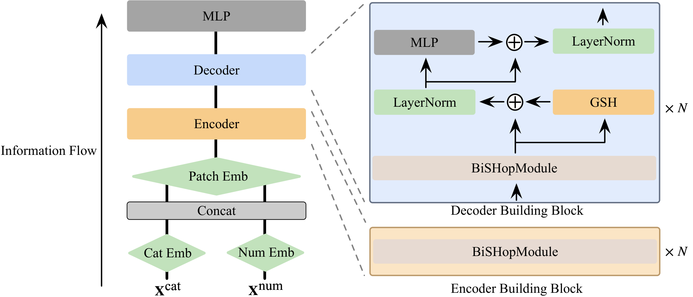
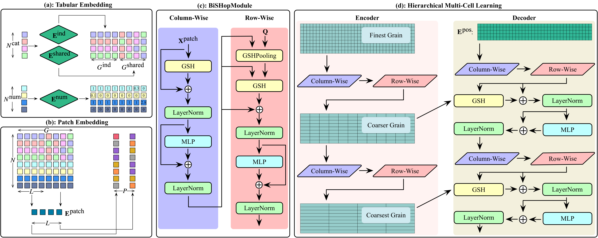
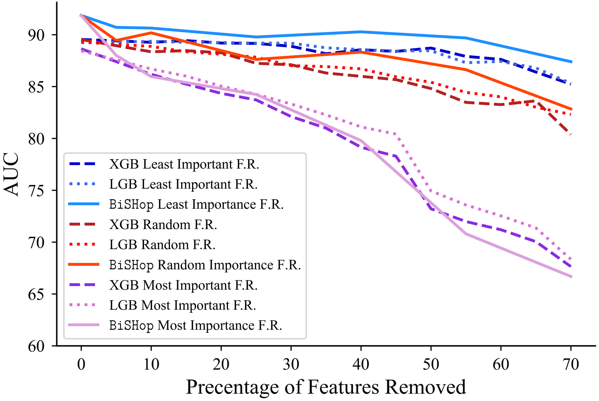
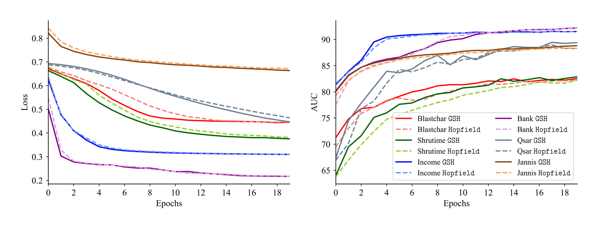

# BiSHop: Bi-Directional Cellular Learning for Tabular Data with Generalized Sparse Modern Hopfield Model

[](https://arxiv.org/abs/2404.03830)
[](https://icml.cc/virtual/2024/poster/32967)
[](LICENSE)
[](https://www.python.org/)
[](https://pytorch.org/)

[Chenwei Xu](https://chenwei-1999.github.io/)<sup>1</sup>,
Yu-Chao Huang<sup>2</sup>,
[Jerry Yao-Chieh Hu](https://jerryyaochiehhu.github.io/)<sup>1</sup>,
Weijian Li<sup>1</sup>,
Ammar Gilani<sup>1</sup>,
[Hsi-Sheng Goan](https://www.phys.ntu.edu.tw/~goan/)<sup>2</sup>,
[Han Liu](https://magics.cs.northwestern.edu/people.html)<sup>1</sup>

<sup>1</sup> Northwestern University &nbsp;&nbsp; <sup>2</sup> National Taiwan University

---

## Overview

<p align="center">
  
</p>

**BiSHop** is an end-to-end deep learning framework for tabular data that leverages a **Generalized Sparse Modern Hopfield Model** with learnable sparsity. It processes data through bi-directional (column-wise and row-wise) modules to capture both intra-feature and inter-feature interactions at multiple scales.

**TL;DR** &mdash; BiSHop introduces a **bi-directional sparse Hopfield network** for tabular learning that achieves **SOTA on 18 out of 28 benchmarks** (9 classification + 19 OpenML datasets), surpassing both deep learning and tree-based methods, while requiring **<10% of the hyperparameter optimization (HPO) budget** used by baselines.

### Highlights

- **Novel architecture**: Bi-directional cellular learning with column-wise and row-wise sparse Hopfield modules for multi-scale representation learning
- **State-of-the-art results**: Best performance on 18 out of 28 benchmarks across diverse tabular tasks (classification and regression)
- **HPO efficiency**: Achieves top results with <10% of the hyperparameter search budget used by competing methods
- **Strong generalization**: Consistent performance across datasets with varying sizes, feature types (numerical, categorical, mixed), and task types
- **Sparse Hopfield model**: Learnable sparsity via entmax activation, providing an adaptive sparse extension of the modern Hopfield model

---

## Architecture

<p align="center">
  
</p>

BiSHop consists of the following key components:

| Component | Description |
|---|---|
| **Categorical Embedding** | Learned lookup embeddings for categorical features |
| **Numerical Embedding** | Piecewise-linear encoding for continuous features |
| **Patch Embedding** | Groups feature embeddings into patches for hierarchical processing |
| **BiSHop Module** | Core bi-directional module with column-wise (intra-feature) and row-wise (inter-feature) sparse Hopfield layers |
| **Encoder** | Stacked BiSHop modules with hierarchical multi-cell aggregation |
| **Decoder** | Cross-attention decoder that refines encoder representations |
| **MLP Head** | Task-specific prediction head for classification or regression |

---

## Results

### Dataset I: Classification Benchmarks (AUC %)

Results on 9 binary classification datasets. **Bold** = best.

| Method | Adult | Bank | Blastchar | Income | Seismic | Shrutime | Spambase | Qsar | Jannis |
|---|:---:|:---:|:---:|:---:|:---:|:---:|:---:|:---:|:---:|
| MLP | 72.5 | 92.9 | 83.9 | 90.5 | 73.5 | 84.6 | 98.4 | 91.0 | 82.59 |
| TabNet | 90.49 | 91.76 | 79.61 | 90.72 | 77.77 | 84.39 | 99.80 | 67.55 | 87.81 |
| TabTransformer | 73.7 | 93.4 | 83.5 | 90.6 | 75.1 | 85.6 | 98.5 | 91.8 | 82.85 |
| FT-Transformer | 90.60 | 91.83 | 86.06 | 92.15 | 74.60 | 80.83 | **100** | 92.04 | 89.02 |
| SAINT | 91.6 | 93.30 | 84.67 | 91.67 | 76.6 | 86.47 | 98.54 | 93.21 | 85.52 |
| TabPFN | 88.48 | 88.17 | 84.03 | 88.59 | 75.32 | 83.30 | 100 | 93.31 | 78.34 |
| TANGOS | 90.23 | 88.98 | 85.74 | 90.44 | 73.52 | 84.32 | 100 | 90.83 | 83.59 |
| T2G-FORMER | 85.96 | **94.47** | 85.40 | 92.35 | 82.58 | 86.42 | 100 | 94.86 | 73.68 |
| LightGBM | 92.9 | 93.39 | 83.17 | 92.57 | 77.43 | 85.36 | **100** | 92.97 | 87.48 |
| CatBoost | 92.8 | 90.47 | 84.77 | 90.80 | 81.59 | 85.44 | **100** | 93.05 | 87.53 |
| XGBoost | 92.8 | 92.96 | 81.78 | 92.31 | 75.3 | 83.59 | **100** | 92.70 | 86.72 |
| **BiSHop** | **92.97** | 93.95 | **88.49** | **92.97** | **91.88** | **87.99** | **100** | **96.14** | **90.63** |

### Dataset II: OpenML Benchmarks (19 Datasets)

Summary of results across 19 OpenML datasets spanning 4 task types: categorical classification (CC), numerical classification (NC), categorical regression (CR), and numerical regression (NR). Metrics: Accuracy for classification, R² for regression (both in %).

| | BiSHop | FT-Trans | GBDT | MLP | RandomForest | ResNet | SAINT | XGBoost |
|---|:---:|:---:|:---:|:---:|:---:|:---:|:---:|:---:|
| **Mean Score** | **81.21** | 80.34 | 80.48 | 80.30 | 79.84 | 79.81 | 79.68 | 80.65 |
| **Mean Rank** | **2.79** | 3.58 | 4.21 | 4.74 | 5.53 | 5.05 | 5.26 | 3.84 |
| **Median Rank** | **1** | 4 | 4 | 5 | 6 | 5 | 5 | 3 |
| **Avg. HPO Runs** | **~28** | 200 | 200 | 200 | 200 | 200 | 200 | 200 |

BiSHop achieves **11 optimal** and **8 near-optimal** results (within 1.3% margin) across all 19 datasets, using on average **less than 10%** of the HPO budget of the baselines.

---

## Ablation Studies

### Feature Sparsity Robustness

<p align="center">
  
</p>

BiSHop maintains strong performance under progressive feature removal, demonstrating robustness to feature sparsity. Performance is evaluated when removing the most important, least important, and random features.

### Convergence Analysis

<p align="center">
  
</p>

BiSHop converges faster and more stably compared to baseline methods across different datasets.

---

## Installation

### Requirements

- Python 3.10+
- PyTorch 2.2+ (with CUDA support)
- Weights & Biases (for HPO and experiment tracking)

### Setup

```bash
# Clone the repository
git clone https://github.com/MAGICS-LAB/BiSHop.git
cd BiSHop

# Create and activate conda environment
conda create -n BiSHop python=3.10
conda activate BiSHop

# Install PyTorch (adjust for your CUDA version)
pip3 install torch --index-url https://download.pytorch.org/whl/cu121

# Install dependencies
pip3 install -r requirements.txt
```

---

## Datasets

### Dataset I (Baseline I)

Create the datasets directory and download from Google Drive:

```bash
mkdir datasets
```

Download from: [Baseline I Datasets (Google Drive)](https://drive.google.com/drive/folders/1T3oIYKXqnxyXhs-bHpGKABjR3tOHsAyr?usp=sharing)

Place all downloaded CSV files into the `datasets/` directory.

**Available datasets:** Adult, Bank, Blastchar, 1995_Income, SeismicBumps, Shrutime, Spambase, Qsar, Jannis

### Dataset II (Baseline II)

OpenML datasets are downloaded automatically at runtime. No manual setup required.

---

## Usage

### Quick Start with Pre-Tuned Configs

Pre-tuned configurations for Dataset I benchmarks are available in `config/`. To run with optimal hyperparameters:

```bash
python bishop.py --data adult --sweep
```

This loads the tuned hyperparameters from `config/adult.yaml`. Available configs: `adult`, `bank`, `blast`, `income`, `jan`, `seis`, `shru`, `spam`, `qsar`.

### Hyperparameter Optimization with W&B Sweeps

#### Dataset I

```bash
# Create and launch a sweep
python launch_baseline1.py --data adult --project bishop_baseline1

# Run the sweep agent (copy the agent name from output)
wandb agent <AGENT_NAME>
```

#### Dataset II (OpenML)

```bash
# Launch with OpenML dataset ID
python launch_baseline2.py --data 361110 --project bishop_baseline2

# Run the sweep agent
wandb agent <AGENT_NAME>
```

### Recording Runs

To log experiments to Weights & Biases, update your API key in `utils/wandb_api_key.txt` and add the `--record` flag:

```bash
python bishop.py --data adult --record
```

### Key Arguments

| Argument | Default | Description |
|---|---|---|
| `--data` | `OpenML` | Dataset name (e.g., `adult`) or `OpenML` for Baseline II |
| `--task_id` | — | OpenML task ID (for Baseline II) |
| `--patch_dim` | `8` | Patch/segment length for patch embeddings |
| `--emb_dim` | `32` | Embedding dimension for feature embeddings |
| `--n_agg` | `4` | Number of aggregations per encoder level |
| `--factor` | `10` | Factor for the BiSHop attention module |
| `--d_model` | `256` | Hidden dimension in Generalized Sparse Hopfield layers |
| `--d_ff` | `512` | Feed-forward dimension in Hopfield layers |
| `--n_heads` | `4` | Number of attention heads |
| `--e_layers` | `3` | Number of encoder layers |
| `--d_layers` | `1` | Number of decoder layers |
| `--dropout` | `0.2` | Dropout rate |
| `--batch_size` | `32` | Training batch size |
| `--train_epochs` | `200` | Maximum training epochs |
| `--patience` | `40` | Early stopping patience |
| `--learning_rate` | `5e-5` | Initial learning rate |
| `--mode` | `entmax` | Sparse activation mode |
| `--seed` | `66` | Random seed |

---

## Repository Structure

```
BiSHop/
├── bishop.py                 # Main training/evaluation script
├── bishop.yaml               # W&B sweep configuration (auto-generated)
├── launch_baseline1.py       # Sweep launcher for Dataset I
├── launch_baseline2.py       # Sweep launcher for Dataset II (OpenML)
├── requirements.txt          # Python dependencies
├── config/                   # Pre-tuned hyperparameter configs
│   ├── adult.yaml
│   ├── bank.yaml
│   ├── blast.yaml
│   ├── income.yaml
│   ├── jan.yaml
│   ├── seis.yaml
│   ├── shru.yaml
│   ├── spam.yaml
│   └── qsar.yaml
├── data/
│   └── data_loader.py        # Dataset loading and preprocessing
├── datasets/                 # Downloaded datasets (not tracked)
├── exp/
│   └── exp_bishop.py         # Experiment runner (train/test loops)
├── models/
│   ├── model.py              # BiSHop model definition
│   ├── module.py             # BiSHop module and MLP head
│   ├── encoder.py            # Hierarchical encoder
│   ├── decoder.py            # Cross-attention decoder
│   ├── attn.py               # Sparse Hopfield attention layers
│   ├── embed.py              # Categorical and numerical embeddings
│   └── entmax.py             # Entmax sparse activation
├── utils/
│   ├── tools.py              # Utility functions
│   └── metrics.py            # Evaluation metrics
├── figures/                  # Figures for README
└── paper/                    # Paper source files
```

---

## Reproducing Ablations

### Feature Removal Experiments

BiSHop supports controlled feature removal to study robustness to feature sparsity. Use **one** of the following flags:

```bash
# Remove top-X% most important features
python bishop.py --data adult --rf_most 20

# Remove top-X% least important features
python bishop.py --data adult --rf_least 20

# Remove X% of features randomly
python bishop.py --data adult --rf_rand 20
```

Feature importance is computed via gradient-based attribution. Only one removal flag should be used at a time.

---

## Citation

If you find this work useful, please cite our paper:

```bibtex
@inproceedings{xu2024bishop,
  title     = {BiSHop: Bi-Directional Cellular Learning for Tabular Data with Generalized Sparse Modern Hopfield Model},
  author    = {Xu, Chenwei and Huang, Yu-Chao and Hu, Jerry Yao-Chieh and Li, Weijian and Gilani, Ammar and Goan, Hsi-Sheng and Liu, Han},
  booktitle = {Forty-first International Conference on Machine Learning (ICML)},
  year      = {2024},
  url       = {https://arxiv.org/abs/2404.03830}
}
```

---

## Acknowledgments

This work is developed by the [MAGICS Lab](https://magics.cs.northwestern.edu/) at Northwestern University, in collaboration with National Taiwan University.

## License

This project is licensed under the [Apache License 2.0](LICENSE).
